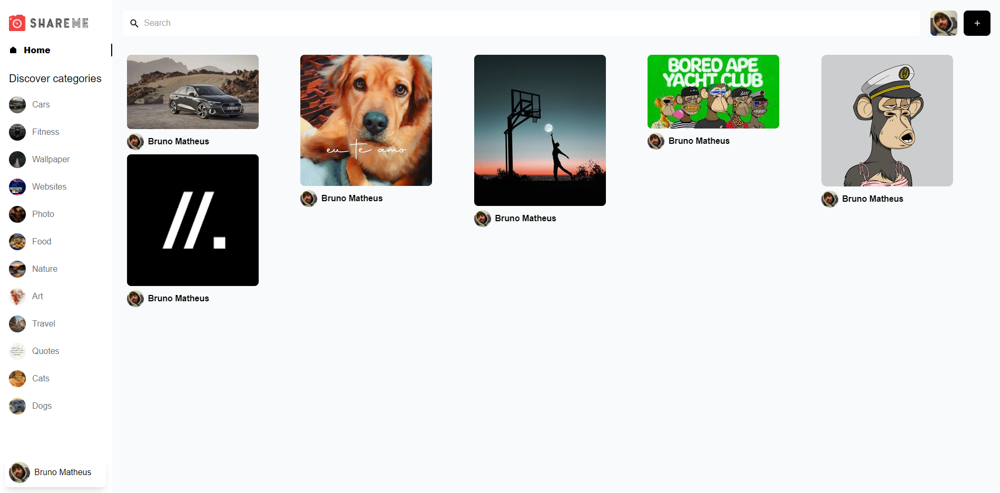
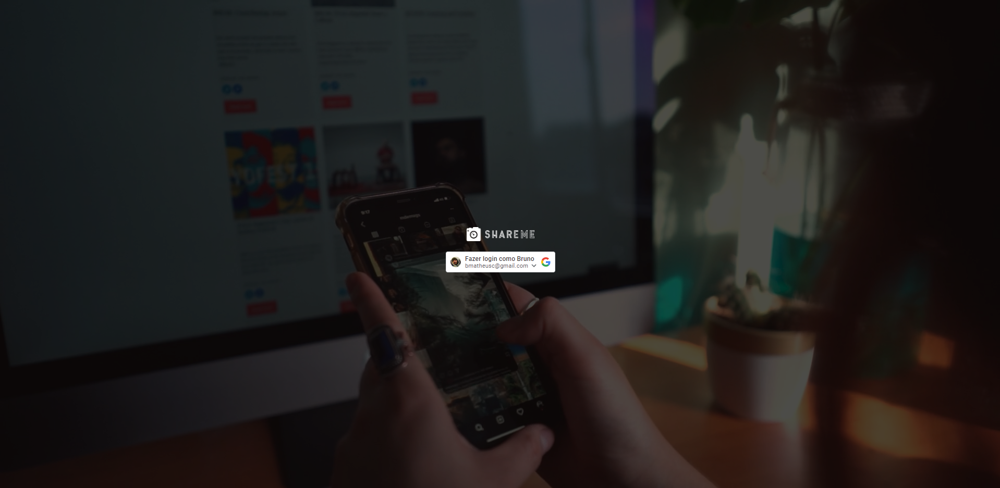
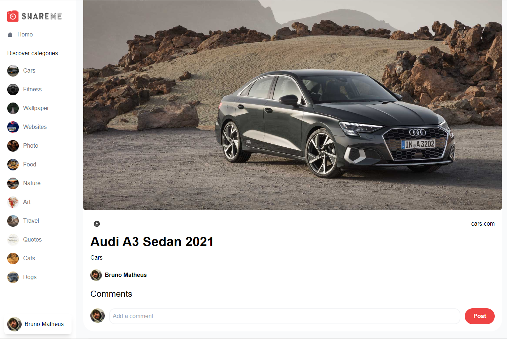
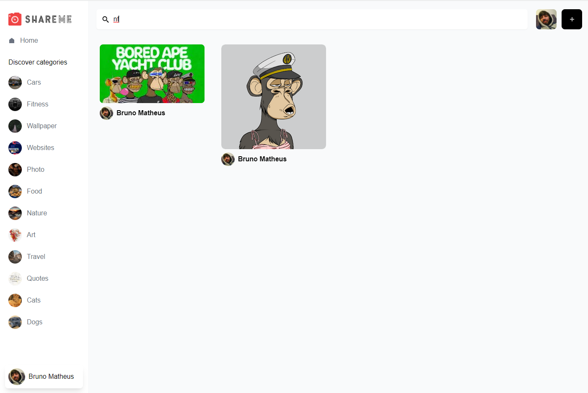

## ShareMe

This project is base on a YouTube tutorial by [Adrian Hajdin - JSMastery](https://github.com/adrianhajdin) for developing a Social Media Application based on Pinterest where you can create, save, comment and share pins.

Also, we developed some search functionality and divided by category.

Unlike the original project, I chose to use [Nextjs] instead of using pure react because of the SSG and SSR. Also I added typescript.

As an extra part, I added a next-js progressbar and a toaster for some user interation.

### Home

    

### Login

    

### Pin Detail

    

### Search

    

In this project we use:
- [React](https://reactjs.org/)
- [NextJs](https://nextjs.org/)
- [Sanity](https://www.sanity.io/)
- [TypeScript](https://www.typescriptlang.org/)
- [Tailwindcss](https://tailwindcss.com/)

## Cloning and Starting the project:

Clone the repo as following:

### `git clone https://github.com/brunomatheusc/share-me-social.git`

### `cd frontend`

### `yarn dev`

Open [http://localhost:4001](http://localhost:4001) to see the app on your browser.

